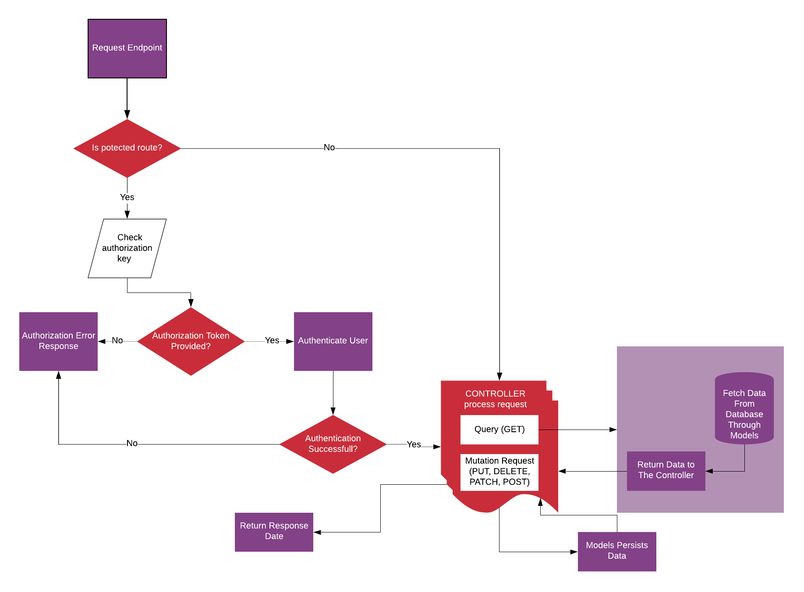

# DevMentor API

> Backend Api for DevMentor application which is a bootcamp directory. You can checkout the specs for this API [DevMentor API Specs](https://docs.google.com/document/d/1ZpYxx2H4kjCCHIVc4wXK1DKvm13llQs9j27bDX_rQ_0/edit?usp=sharing) . And you can check out the API [DevMentor API](https://devmentor.host)

## PROJECT ARCHITECTURE

The development of this API took into account several specific needs. It is carefully crafted as one that can easily require updates and new features, taking into account the need for scalability, easy maintainance, performance and security. I have chosen to use the MODEL-VIEW CONTROLLER (MVC)
architecture.

### A top-level directory structure

```
C:.
│   .eslintrc.json
│   .gitignore
│   .prettierrc.json
│   package-lock.json
│   package.json
│   README.md
│   seeder.js          # seed dump and script
│   server.js
│
├───config
│       config.env            # load all project-wide constants including environment variables
│       db.js                 # database configuration
│
├───controllers               # handles the http request and returns the response
│       auth.js
│       bootcamps.js
│       courses.js
│       reviews.js
│       users.js
│
├───middleware                # all middlewares
│       advanceResults.js
│       async.js              # wrapper for all async functions
│       errorHandler.js
│       protect.js
│
├───models                    # models the  schema and provides data access methods
│       Bootcamps.js
│       Courses.js
│       Reviews.js
│       User.js
│
├───public                    # serve static files used in the postman documentation
│   │   index.html
│   │
│   ├───fonts
│   │       glyphicons-halflings-regular.eot
│   │       glyphicons-halflings-regular.ttf
│   │       glyphicons-halflings-regular.woff
│   │       glyphicons-halflings-regular.woff2
│   │
│   └───uploads
│           photo-5d713a66ec8f2b88b8f830b8.jpg
│
├───routes
│       auth.js
│       bootcamps.js
│       course.js
│       reviews.js
│       users.js
│
├───utils                    # some utilities used within the project
│       email.js
│       errorResponse.js
│       geocoder.js
│
└───_data
       bootcamps.json
       courses.json
       reviews.json
       users.json

```

## API FLOW

The flow of actions across the API can best be described with this diagram.


## Usage

Rename "config/config.env.env" to "config/config.env" and update the values/settings to your own.

## Install Dependencies

```
npm install
```

## Run App

```
# run in development
npm run dev

#run in production
npm start
```

- version: 1.0.0
- licence: MIT
